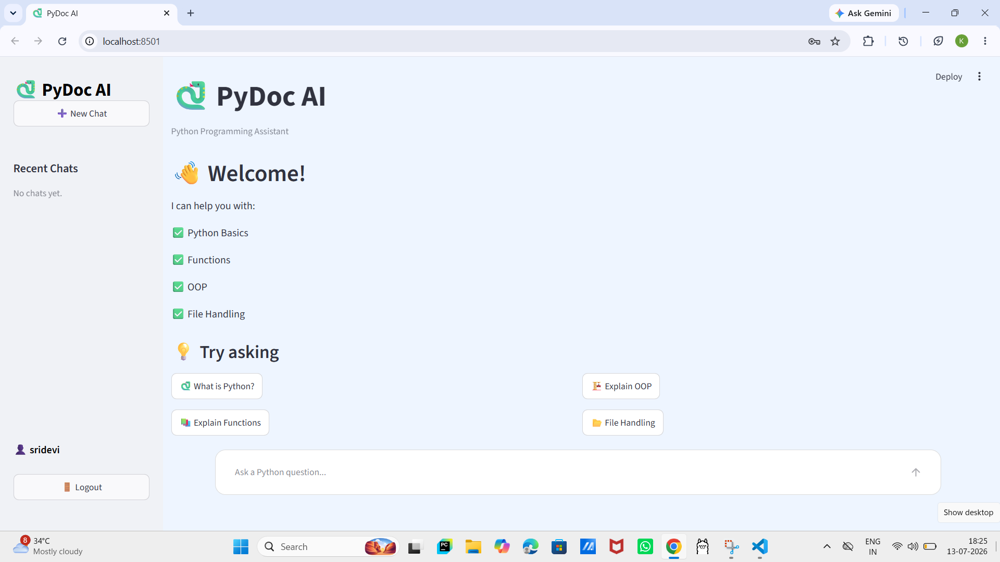
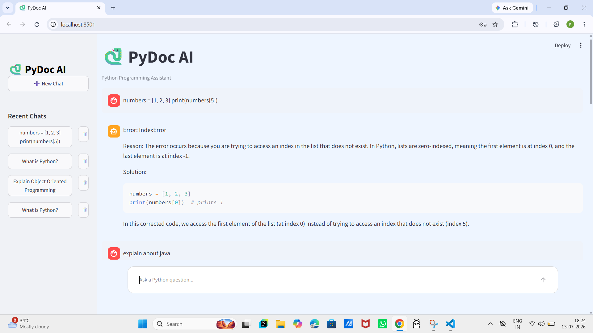

# 🐍 PyDoc AI

## Problem Statement

Learning Python programming often requires searching through multiple documentation pages, tutorials, and error solutions. Beginners and developers may find it difficult to quickly understand Python concepts, syntax, and common errors.
The goal of PyDoc AI is to provide an AI-powered assistant that helps users get quick and accurate answers to Python-related questions by using a Python knowledge base and Retrieval Augmented Generation (RAG).


## Overview

PyDoc AI is an AI-powered Python Documentation Assistant chatbot designed to help users learn and troubleshoot Python programming concepts.
The chatbot uses Large Language Models (LLM) with Retrieval Augmented Generation (RAG) to retrieve relevant information from Python documentation and generate helpful responses.

PyDoc AI helps users learn Python programming by answering questions related to:

- Python Basics
- Data Types
- Operators
- Control Flow
- Functions
- Object-Oriented Programming
- File Handling
- Exception Handling
- Modules
- Common Errors
- Best Practices

The chatbot retrieves relevant information from a Python knowledge base before generating responses, improving accuracy and ensuring domain-specific answers.

## 🚀 Features

- User Registration & Login
- Interactive Chat Interface
- Retrieval-Augmented Generation (RAG)
- Local Llama 3.2 Model using Ollama
- Python Documentation Knowledge Base
- Chat History Storage
- Delete Individual Chats
- Start New Chat
- Domain-Specific Responses
- Suggested Questions
- Modern Streamlit UI

## 🛠 Tech Stack

**Frontend**
- Streamlit

**Backend**
- Python

**AI Model**
- Llama 3.2 (Ollama)

**Vector Database**
- ChromaDB

**Embeddings**
- Sentence Transformers

**Database**
- SQLite

**Libraries**
- LangChain
- Streamlit
- ChromaDB
- Sentence Transformers
- Ollama
- SQLite3

## 📂 Project Structure

```text
PyDoc_AI/
│
├── app.py
├── auth.py
├── database.py
├── chat_history.py
├── evaluation.py
├── build_vector_db.py
├── requirements.txt
├── README.md
├── users.db
│
├── rag_docs/
│   ├── python_basics.md
│   ├── data_types.md
│   ├── operators.md
│   ├── control_flow.md
│   ├── functions.md
│   ├── oops.md
│   ├── file_handling.md
│   ├── exception_handling.md
│   ├── modules.md
│   ├── common_errors.md
│   └── best_practices.md
│
├── chroma_db/
│
└── src/
    ├── __init__.py
    ├── chatbot.py
    ├── config.py
    ├── document_loader.py
    ├── embeddings.py
    ├── ingest.py
    ├── llm.py
    ├── prompts.py
    ├── rag.py
    ├── rag_pipeline.py
    ├── retriever.py
    ├── text_splitter.py
    └── vector_store.py
    
```

## ⚙ Installation

Clone the repository

```bash
git clone  https://github.com/Sridevi762/PyDoc_AI
```

Move into the project folder

```bash
cd PyDoc-AI
```

Create a virtual environment

```bash
python -m venv venv
```

Activate the environment

Windows

```bash
venv\Scripts\activate
```

Linux / Mac

```bash
source venv/bin/activate
```

Install dependencies

```bash
pip install -r requirements.txt
```

## Install Ollama

Download and install Ollama.

Pull the Llama model.

```bash
ollama pull llama3.2
```

Run the model.

```bash
ollama run llama3.2
```

## Create Embeddings

```bash
python embeddings.py
```

This creates the vector database from the Python documentation.

## Run the Application

```bash
streamlit run app.py
```


## How It Works

1. User asks a Python-related question.
2. The retriever searches the Python knowledge base for relevant documents.
3. Relevant document chunks are retrieved and added as context.
4. The context and user query are passed to the Llama 3.2 model.
5. If relevant information is available in the knowledge base, the model uses the retrieved context to generate a grounded response.
6. If the required information is not available in the knowledge base, the model can use its pre-trained knowledge to answer the Python question.
7. The chatbot displays the final response to the user.

## Screenshots

### Chat Interface



### Python Question Answering



## Knowledge Base

The chatbot uses Markdown documentation covering:

- Python Basics
- Data Types
- Operators
- Control Flow
- Functions
- OOP
- Modules
- File Handling
- Exception Handling
- Common Errors
- Best Practices

## Evaluation

The chatbot was tested using multiple Python programming questions, including:

- What is Python?
- Explain loops.
- What is inheritance?
- Explain exception handling.
- Difference between list and tuple.
- Explain decorators.
- Explain file handling.

The chatbot successfully answered domain-specific questions using the RAG pipeline.

## Why RAG Instead of Fine-Tuning?

This project uses Retrieval-Augmented Generation (RAG) instead of fine-tuning because it:

- Retrieves relevant documentation before answering.
- Produces accurate, domain-specific responses.
- Reduces hallucinations.
- Does not require expensive model training.
- Is lightweight and efficient for local deployment.

## Trade-off

Using RAG provides accurate responses without expensive fine-tuning. However, response quality depends on the quality and completeness of the knowledge base.

## Future Improvements

- Source Citations
- Automatic Knowledge Base Updates using Web Scraping
- Voice Assistant
- Dark Mode
- Code Execution Support

